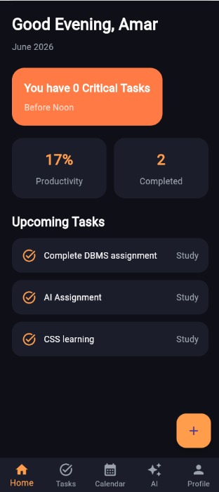
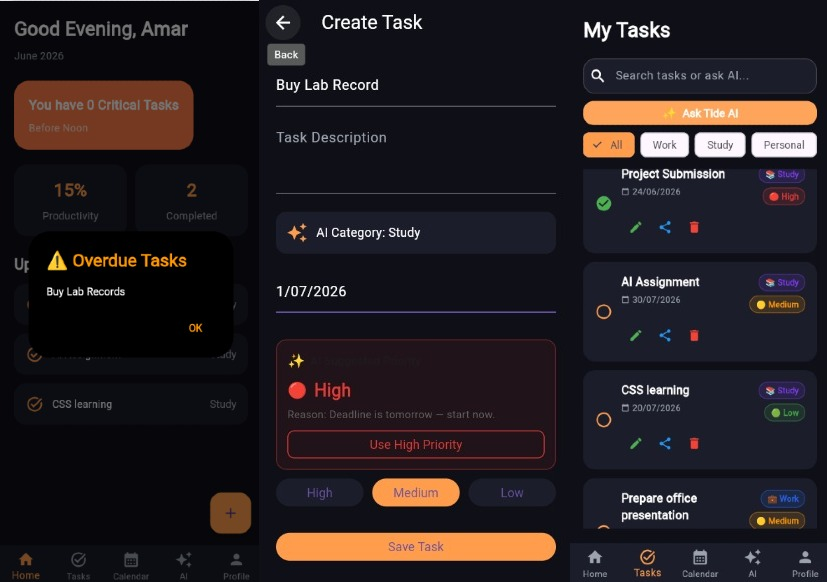
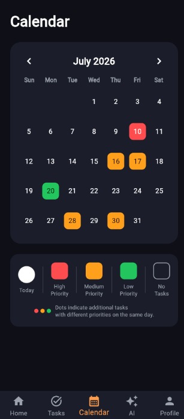
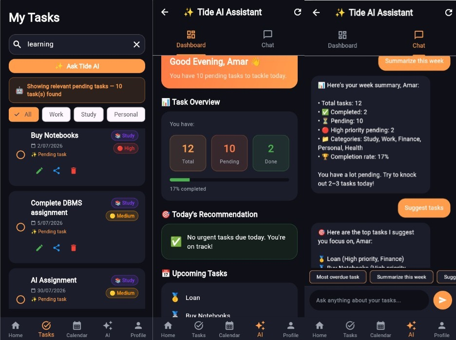
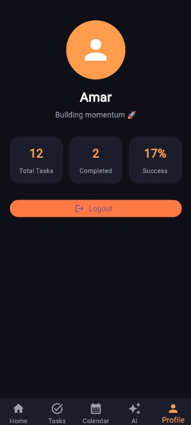

# Personal Developer Portfolio 🚀


A personal developer portfolio website built to showcase my skills, projects, learning journey, and software development experiments.

The project also includes Python automation experiments and GitHub Actions workflows demonstrating CI/CD concepts.

---

# 🌐 Portfolio Preview


🌐 **Live Website:**  
https://amritha-lal.github.io/amritha_portfolio/

---
---

# 🌊 Featured Project

## TIDE-AI Productivity Application


TIDE-AI is a productivity and task management mobile application concept designed using Figma and implemented using Flutter.

Features:

- Task Management
- Calendar Management
- Productivity Tracking
- AI-inspired Assistant Interface

Technologies:
https://amritha-lal.github.io/amritha_portfolio/tideai.html
- Flutter
- Dart
- Figma

Project Details:
 
 https://amritha-lal.github.io/amritha_portfolio/tideai.html

---
# 📱 TIDE-AI Application Screens

The Flutter implementation of TIDE-AI includes multiple screens demonstrating the application workflow and user interface design.

<div align="center">

### 🔐 Login Screen


### 🏠 Home Dashboard




### 📋 Task Management




### 📅 Calendar Management




### 🤖 AI Assistant Interface




### 👤 User Profile



</div>

## 👩‍💻 About Me

Hi, I'm **Amritha Lal**, a B.Tech Computer Science & Engineering student with a background in Diploma Computer Engineering.

I am interested in:

- Software Development
- Web Technologies
- Python Programming
- Artificial Intelligence Exploration
- Digital Product Design
- Automation

I enjoy building practical projects while continuously improving my technical skills.

---

# ✨ Portfolio Overview

Personal Developer Portfolio is a personal portfolio website designed to present:

- My technical skills
- Projects and prototypes
- Learning journey
- Development experiments
- Contact information

The project also includes automation scripts that demonstrate working with APIs, data fetching, and scheduled workflows.

---

# 🎯 Features

## Portfolio Website

- Responsive personal portfolio
- Hero introduction section
- About section
- Skills showcase
- Featured projects
- Project gallery
- Contact section

---

### 🔗 GitHub Data Fetching

Experiment with retrieving GitHub-related information.

File:

```
github_fetch.py
```

---

# 🛠 Technologies Used

## Frontend

- HTML5
- CSS3
- JavaScript

## Programming

- Python

## Tools

- Git
- GitHub
- GitHub Actions
- Visual Studio Code

## Design

- Figma

---

# 📂 Project Structure

```
amritha_portfolio/

│
├── index.html                 # Main portfolio webpage
├── tideai.html                # TIDE-AI detailed project page
│
├── style.css                  # Website styling
├── script.js                  # JavaScript functionality
│
├── profile.jpeg               # Profile image
│
├── portfolio-home.jpeg        # Portfolio preview image
│
├── tideai-cover.jpeg          # TIDE-AI project cover image
├── tideai-demo.webm           # TIDE-AI application demo video
│
├── login.jpeg                 # TIDE-AI login screen
├── home.jpeg                  # TIDE-AI home dashboard screen
├── task.jpeg                  # TIDE-AI task management screen
├── calendar.jpeg              # TIDE-AI calendar screen
├── AI.jpeg                    # TIDE-AI assistant interface screen
├── profile-page.jpeg          # TIDE-AI user profile screen
│
└── README.md                  # Project documentation
```

# ⚙️ GitHub Actions

This project uses GitHub Actions workflows for automation.

Current workflows:

- Portfolio deployment automation
- News automation workflow
- Weather automation workflow

These workflows demonstrate CI/CD concepts and scheduled task execution.

---

# 🌱 Learning Outcomes

Through this project, I explored:

- Building responsive websites
- Structuring frontend projects
- Working with Git and GitHub
- Using GitHub Actions
- Python automation concepts
- Managing project documentation
- Deploying websites using GitHub Pages

---

# 🔮 Future Improvements

Planned improvements:

- Add more real-world projects
- Improve UI/UX
- Add backend integration
- Connect projects with APIs
- Enhance automation workflows

---

# 📬 Contact

**Amritha Lal**

LinkedIn:
https://www.linkedin.com/in/amritha-lal-8558aa262

GitHub:
https://github.com/AMRITHA-LAL

Portfolio:
https://amritha-lal.github.io/amritha_portfolio/

---

⭐ If you find this project interesting, feel free to explore the repository.
